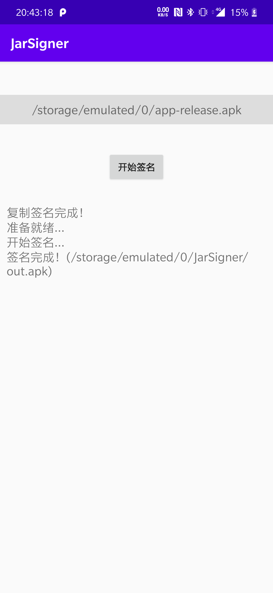

## 说明

本项目使用的是v1签名，生成的APK可适用所有Android版本。

本项目运行需要Android7.0及以上。

本项目的关于签名的源码全部来源于 https://github.com/frohoff/jdk8u-jdk ，用于给`Android Apk`签名

之所以要有这个项目，是因为`Android Studio`中是用不了`jdk`中的库，所以需要手动把以来挑出来

1. 如果是使用`java`开发，只需要复制 `com.sun.jarsigner` 和 `sun.security.tools.jarsigner` 两个`package`到你的项目中即可
2. 如果是使用`android`开发，则需要手动导入本项目中的所有源代码

## 效果



## 使用

1. 直接使用打包好的`jar`包([链接](https://github.com/JankingWon/JarSigner/releases))，在命令行中输入

   ```bash
   //linux
   $jarsigner [-verbose] -keystore "~/Desktop/test.jks"  -storepass 123456  -keyPass 123456 -signedjar "~/Desktop/test.apk" "~/Desktop/unsigned.apk" test
   //windows
   $java -jar .\jarsigner.jar -verbose -keystore "C:\\Users\\janki\\Desktop\\test.jks"  -storepass 123456  -keyPass 123456 -signedjar "C:\\Users\\janki\\Desktop\\test.apk" "C:\\Users\\janki\\Desktop\\unsigned.apk" test
   ```

2. 使用源码，调用`sun.security.tools.jarsigner.Main#main(String[] args)`方法，参数同上

## 注意
**如果是在`Android`设备上使用，要使用`BKS-V1`类型的秘钥，一般用`AndroidStudio`生成的`jks`秘钥是`JKS`类型，可以使用 [KeyStore Explorer](https://keystore-explorer.org/) 查看和转换签名类型**

**如果使用`jar`包或在PC端使用代码运行，使用`BKS-V1`类型秘钥，会弹出“错误: java.lang.RuntimeException: 密钥库加载: Invalid keystore format”，改成`jks`可以解决**
