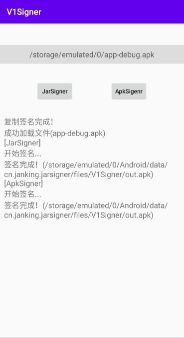

[](https://jitpack.io/#cn.janking/V1Signer)
[](https://github.com/JankingWon/V1Signer/releases/latest)

## 说明

**Android APK v1签名库，便于开发跟APK签名有关的应用 或者利用生成的jar包手动签名**

本项目包含两个`Module`

* `JarSigner`
* `ApkSigner`

**还有一个名为`app`的DEMO模块，可运行试用**

使用的均是V1签名，签名后可适用所有Android版本。

本项目可在Android7.0及以上运行（暂不兼容Android10.0）

> 由于`JarSigner`和`ApkSigner`中有相同的`class`，无法打包成`release`的`APK`，接入时需要去掉一个`module`，但是`debug`模式可以直接运行

## 效果

</img>

## JarSigner

本`Module`的关于签名的源码全部来源于 https://github.com/frohoff/jdk8u-jdk ，用于给`Android Apk`签名

### 开发使用

1. 如果是使用`java`开发，只需要复制 `com.sun.jarsigner` 和 `sun.security.tools.jarsigner` 两个`package`到你的项目中即可

2. 如果是`android`开发
     1. 添加`jitpack`的maven库

        ```
        repositories {
          maven { url 'https://jitpack.io' }
        }
        ```

     2. 添加依赖

        ```
        dependencies {
            implementation 'cn.janking:V1Signer:jarsigner:0.0.1'
        }
        ```
     
3. 调用`sun.security.tools.jarsigner.Main.main(String[] args)`

     ```kotlin
     //例如
     sun.security.tools.jarsigner.Main.main(
         arrayOf(
             "-verbose",
             "-keystore", "[keystore路径]",
             "-storepass", "[storepass]",
             "-keyPass", "[keyPassword]",
             "-signedjar",
             "[签名后apk输出路径]",
             "[待签名apk路径]",
             "[key alias秘钥别名]"
         )
     )
     ```

### 手动使用

直接使用打包好的`jarsigner.jar`包([链接](https://github.com/JankingWon/V1Signer/releases))，在命令行中输入

```bash
//linux
$jarsigner [-verbose] -keystore "~/Desktop/test.jks"  -storepass 123456  -keyPass 123456 -signedjar "~/Desktop/test.apk" "~/Desktop/unsigned.apk" test
//windows
$java -jar .\jarsigner.jar [-verbose] -keystore "C:\\test.jks"  -storepass 123456  -keyPass 123456 -signedjar "C:\\test.apk" "C:\\unsigned.apk" test
```

### 注意

如果是在`Android`设备上适用，要使用`BKS-V1`类型的秘钥，一般用`AndroidStudio`生成的`jks`秘钥是`JKS`类型，可以使用 [KeyStore Explorer](https://keystore-explorer.org/) 查看和转换签名类型

## ApkSigner

本`Module`的关于签名的源码来源于`Android`源码和`jdk1.8.0_241`，使用`IntelliJ Idea`反编译获得，用于给`Android Apk`签名

### 开发使用

1. 如果是`java`开发，只需要复制 `SignApk.java`([链接](https://github.com/JankingWon/V1Signer/blob/master/apksigner/src/main/java/com/android/signapk/SignApk.java))文件到你的项目中即可
2. 如果是`android`开发
     1. 添加`jitpack`的maven库

        ```
        repositories {
          maven { url 'https://jitpack.io' }
        }
        ```

      2. 添加依赖

         ```
         dependencies {
             implementation 'cn.janking:V1Signer:apksigner:0.0.1'
         }
         ```

3. 调用`SignApk.Main(String[] args)`

   ```kotlin
   //例如
   com.android.signapk.SignApk.main(
       arrayOf(
           "[公钥路径]",
           "[私钥路径]",
           "[待签名apk路径]",
           "[签名后apk输出路径]"
       )
   )
   ```

### 手动使用

直接使用打包好的`apksigner.jar`包([链接](https://github.com/JankingWon/V1Signer/releases))，在命令行中输入

```bash
//linux
$signapk [-w] publickey.x509[.pem] privatekey.pk8 input.jar output.jar
//windows
$java -jar apksigner.jar [-w] publickey.x509[.pem] privatekey.pk8 input.jar output.jar
```
